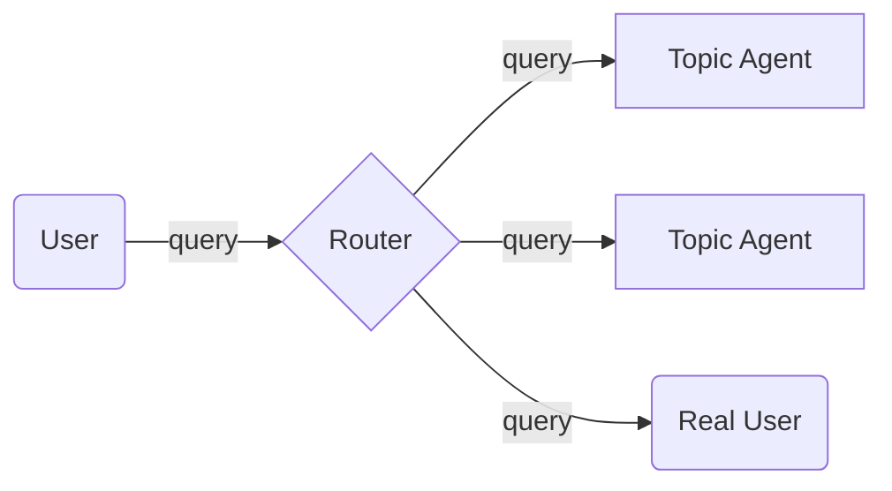

# LLM-Based-Router

## Введение

Представьте, что вы работаете в приемной комиссии магистратуры по Искусственному Интеллекту, каждый день вам пишут десятки студентов с однотипными вопросами в духе "а на какие стажировки я смогу попасть?" или "можно ли к вам без Python?". Вам это в какой-то момент надоело и вы решили это автоматизировать, причем сразу автоматизировать по-умному. 

Вы прикинули, какие основные темы вопросов и разделили их на 4 группы:
- подача документов
- входные испытания
- учебный план и дисциплины
- стажировки

Для каждой тематики вы написали инструкцию для LLM и закинули в контекст различные данные (учебный план, список компаний-партнеров, примеры заданий со входных испытаний).
Так вы получили 4 изолированных агента, каждый из которых отлично умеет отвечать на вопросы по своей теме. 
Но появились 2 проблемы. 
- Как понять, какому агенту нужно передавать вопрос абитуриента?
- И как быть, если ни один агент не подходит?

Вы быстро вспомнили про паттерн **Роутер** в LLM-приложениях, который отвечает за перенаправленеи запросов нужным частям системы. 
В рамках этого паттерна можно решить и вторую проблему, просто перенаправляя исходный запрос в личные сообщения для ответа вручную.


## Описание задания

В этом задании вам необходимо реализовать компонент Router на базе LLM, который будет перенаправлять запрос пользователя различным подсистемам в зависимости от тематики запроса. 


Здесь в качестве Topic Agent понимается агентная подсистема, которая умеет хорошо отвечать на запросы определенной тематики и может использовать специфические инструменты.
В сущности это принцип "разделяй и влавствуй"! Мы автоматизируем техническую поддержку, передавая обработку запросов различной тематики подготовленным ассистентам.
Если запрос нельзя отнести ни к одной выделенной тематике, то он помечатся как "другое" и передается на обработку реальному человеку.

В рамках задания вам достаточно будет реализовать функцию, которая принимает текстовый запрос пользователя и возвращает номер подходящей темы согласно таблице ниже

| Номер | Категория                     |
|:-----:|:------------------------------|
|   1   | подача документов             |
|   2   | входные испытания             |
|   3   | учебный план и дисциплины     |
|   4   | стажировки                    |
|   5   | другое                        |

Не забывайте про качество кода и полезные комментарии!

## Разработка

### Создание виртуального окружения и установка зависимостей 

**Здесь и далее будет использоваться пакетный менеджер uv**

```bash
pip install uv
uv venv --python 3.11
uv sync
```

Для корректного отображения установленных библиотек в Pycharm нужно будет еще выбрать папку .venv в настройках Python Interpreter

### Добавление своей библиотеки (вдруг понадобится)

```bash
uv add <your-package>
```

### Запуск кода

```bash
uv run src/app.py
```

### Запуск тестов

```bash
uv run pytest
```

